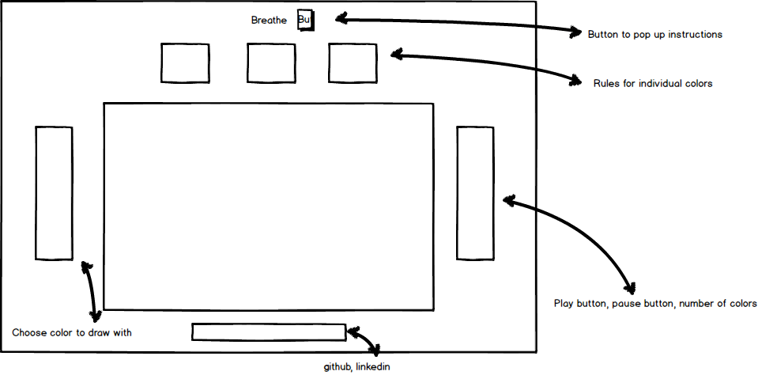

# Breathe

## Background

Breathe is an example of a cellular automaton, a concept in math and computer science that describes a grid of cells whose values are determined by the value of their surrounding cells. One of the most common examples of this concept is Conway's Game of Life.  

In Conway's game of life, a rectangular grid contains cells that start out as either "alive" or "dead", visualized as white or black.  When the game begins, each cell updates according to the following three rules:

* Any live cell with less than 2 alive neighbors, or more than 3 alive neighbors dies
* Any live cell with exactly 2 or 3 neighbors lives
* A dead cell with exactly 3 neighbors comes to life

The grid then keeps updating and rerendering based on these rules.  

Breathe is a javascript implementation of a variation of Conway's Game of Life.  

The variations are described below.

## Functionality and MVP

- [] Play, Pause and Reset buttons for the game board
- Click to select initial state of the board
- Default set of rules for the cells to follow
- Interactively change the rules for a given color
- Extra functionality:
  - Choose number of colors
  - speed of steps
  - 'Paint mode' to paint the board while it's rendering
  - User can edit density of grid

## Wireframe

The app will consist of a single page.  The grid will be in the center, with nav links on the bottom.  Above the grid will be where the user can set/edit rules for each color.  

## Technologies, plugins and APIs

Breathe will be implemented using vanilla javascript in conjunction with jQuery and the Easel.js library.  After researching Easel.js, Fabric.js, Paper.js and Kinetic.js, I am choosing to use Easel due to its stability and features.

Breathe will be broken up into the following scripts/source files:

* board.js
  * contains 2 dimensional array of cell instances
  * iterates through and checks the neighbors of each cell, calls the update function on them accordingly
* cell.js
  * contains constructor and update functions
  * No logic will be done in this cell
  * Has a color property which gets updated by its update method
* boardView.js
  * holds and updates all the Easel.js objects
  * uses setInterval to handle steps and rerendering
* breathe.js
  * Entry file
* util.js
  * Utility code (if required)

## Implementation

**Day 1:**

Set up the skeletons for the files listed above.  Install all appropriate npm packages and set up package.json and webpack config file.  Start to learn Easel in the evening.

**Day 2:**
Keep learning Easel until comfortable rendering the first Canvas object.

Render the grid and all the cell objects, install the event handlers and make sure the backend is working for color, setting color and stepping.

Render the rule objects at the top, install appropriate event handlers.

**Day 3:**

Complete back-end board.js logic for receiving logic from the rules and updating the cells.  Game should function by the end of this day.

**Day 4:**
Install controls and customization from the user.  Style and polishing.
